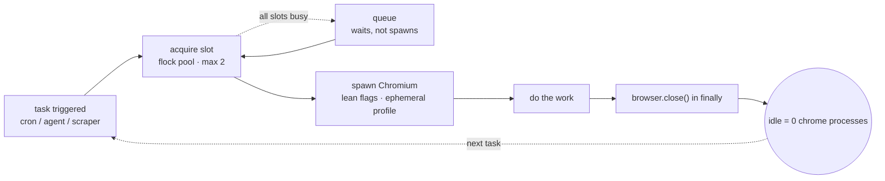

# browser-anti-oom


**Stop letting headless browsers eat your VPS.** A battle-tested recipe for running
Chromium/Firefox as an on-demand tool for AI agents, cron jobs, and scrapers —
without the RAM creep, zombie processes, and 3 AM OOM-killer surprises.

The core idea is simple: **a browser should only exist while a task is running.**
Spawn it, do the work, kill it in `finally`. Idle = zero browser processes.

## The problem

- An agent (or a pile of cron jobs) keeps one persistent browser open "for convenience".
- Each tab spawns renderer processes. Memory leaks accumulate. `/dev/shm` is tiny on
  small VPSes. One day the OOM killer wakes up — and it doesn't always pick the browser.
- 50 cron jobs all spawning a browser at minute `:00` = a stampede that nukes the box.

## The fix, in 30 seconds

1. **On-demand, always.** One task = one browser = `browser.close()` in `finally`.
   When idle, `ps -C chrome` should print **0**.
2. **Lean Chromium flags** — `--disable-dev-shm-usage`, `--renderer-process-limit=2`,
   `--js-flags=--max-old-space-size=384`, headless, no GPU, no extensions.
   (Full annotated list in [`docs/chromium-flags.md`](docs/chromium-flags.md).)
3. **Cap concurrency.** Max 2 browser instances at once; the rest queue.
   [`scripts/pool.sh`](scripts/pool.sh) is a 20-line `flock` pool that auto-releases
   even if the process is `kill -9`'d.
4. **OS safety net.** Swap file + `earlyoom` so that if memory still runs out,
   the browser dies — not your agent. ([`docs/os-guards.md`](docs/os-guards.md))
5. **Isolate with contexts, not profiles.** Browser contexts give you free
   cookie/storage isolation with zero extra disk. ([`docs/profile-strategy.md`](docs/profile-strategy.md))

Impact order: on-demand (1) > lean flags (2) > concurrency cap (3) > OS guards (4).

## How it fits together



One task = one browser = dead browser. The pool caps concurrency, the `finally` guarantees the kill, and the OS guards (`swap` + `earlyoom`, see [`docs/os-guards.md`](docs/os-guards.md)) are the last line of defense if something leaks anyway.

## Quickstart

```bash
git clone https://github.com/YOUR-USER/browser-anti-oom.git
cd browser-anti-oom

# One-shot: fetch a page's DOM with a throwaway headless Chromium,
# auto-killed on timeout, profile cleaned up afterwards.
./scripts/browser-run.sh https://example.com 60
```

Needs: `chromium`, `chromium-browser`, or `google-chrome` on `PATH`.

## What's inside

| Path | What it is |
|---|---|
| `scripts/browser-run.sh` | One-shot headless Chromium: dumps DOM, watchdog-kills on timeout, ephemeral profile in `/tmp`, self-cleaning. |
| `scripts/pool.sh` | `source`-able slot pool (`acquire_slot`, default 2 slots) built on `flock`. Slots release automatically on shell exit. |
| `examples/playwright-ondemand.mjs` | The canonical Playwright pattern: launch → work → `close()` in `finally`. |
| `examples/cron-wrapper.sh` | Compose `pool.sh` + your task so 50 cron jobs never stampede the box. |
| `docs/chromium-flags.md` | Every flag explained: what it does, why it saves RAM, when to skip it. |
| `docs/os-guards.md` | Swap file, `earlyoom`, and systemd `MemoryMax` — the last line of defense. |
| `docs/profile-strategy.md` | Contexts vs. profiles: how to isolate logins without 50 disk-hungry profiles. |

## The canonical pattern (Playwright)

```js
import { chromium } from 'playwright';
import { LEAN_ARGS } from './flags.mjs'; // see examples/

const browser = await chromium.launch({ headless: true, args: LEAN_ARGS });
try {
  const ctx = await browser.newContext(); // ephemeral — no persistent profile
  const page = await ctx.newPage();
  await page.goto(url, { timeout: 60_000 });
  // ... do the work ...
  await ctx.close();
} finally {
  await browser.close(); // ALWAYS. Even on error. Especially on error.
}
```

Puppeteer is the same shape: `puppeteer.launch({ args })` … `finally { await browser.close() }`.

## Rules of thumb

- **Never more than 1–2 tabs per browser.** Finish a tab → `page.close()`.
- **Never mix automation with your main profile.** Cron jobs that need a login get
  their own `cron` profile (via `launchPersistentContext`, closed per task);
  everything else uses ephemeral contexts.
- **Spread cron schedules.** Don't run 50 jobs at `:00` — split across `:07`, `:23`,
  `:41`, etc. Bursty schedules + a pool cap beat a bigger VPS.
- **Measure first.** `ps -o rss,comm -C chrome | awk 'NR>1{sum+=$2} END{print sum/1024 " MB"}'`
  tells you what Chrome is eating right now.

## Who this is for

AI-agent operators, cron-job farmers, and scraper authors running on small VPSes
(2–8 GB RAM) who are tired of babysitting `chrome --headless` processes.

## License

MIT — see [LICENSE](LICENSE). Steal it, ship it, stay OOM-free.
